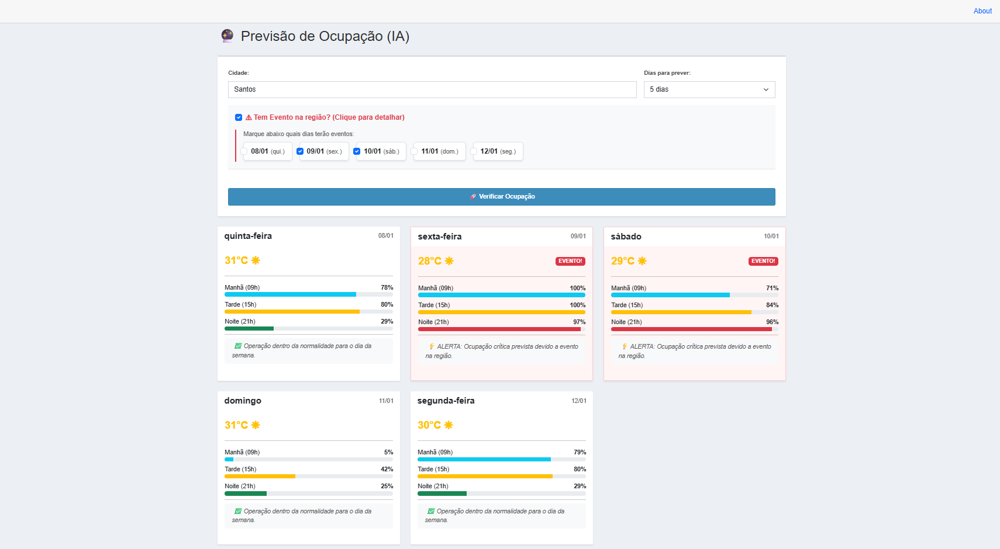
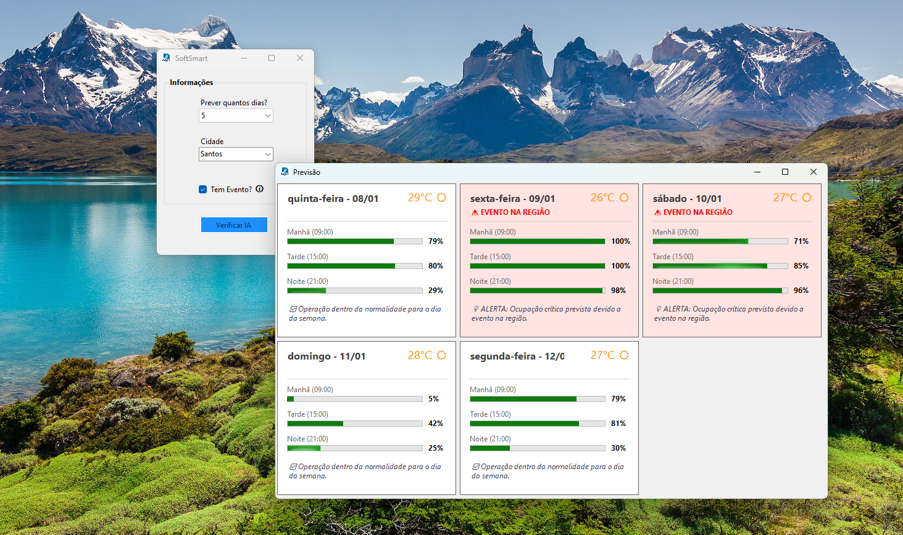

# 🔮 SoftSmart Predict - Previsão de Ocupação com IA

**SoftSmart Predict** é uma solução inteligente desenvolvida para prever a taxa de ocupação de estacionamentos/pátios com base em variáveis externas. O sistema utiliza **Machine Learning** para analisar como o clima, dias da semana, feriados e eventos locais impactam o fluxo de veículos, permitindo uma gestão proativa da equipe e recursos.

---

## 📸 Screenshots

### v2 - Web Dashboard (Blazor)

> Interface moderna e responsiva, permitindo acesso via mobile para gestores em campo.

### v1 - Desktop (Windows Forms)

> Versão inicial focada em processamento local e validação do modelo de IA.

---

## 🚀 Funcionalidades

### 🧠 Inteligência Artificial (Core)
* **Previsão por Turno:** Analisa a ocupação para Manhã (09h), Tarde (15h) e Noite (21h).
* **Análise de Eventos:** Detecta e calcula o impacto crítico de eventos na região (ex: shows, jogos) na lotação noturna.
* **Fatores Climáticos:** Considera temperatura e chuva na previsão de fluxo.

### 💻 Versão Desktop (v1 - Windows Forms)
* Prova de Conceito (PoC) da arquitetura.
* Processamento local rápido.
* Validação dos dados de treinamento.

### 🌐 Versão Web (v2 - Blazor Server)
* **Dashboard Interativo:** Visualização clara com barras de progresso e alertas visuais.
* **Integração com APIs:**
    * **IBGE:** Busca automática de municípios brasileiros.
    * **OpenWeatherMap:** Consulta de previsão do tempo em tempo real para os próximos 5 dias.
* **Gerador de Insights:** Texto gerado automaticamente explicando o *porquê* da previsão (ex: "Lotação crítica devido a evento + chuva").
* **UX Aprimorada:** Inputs inteligentes com busca de cidades e seleção de múltiplos dias de eventos.

### 💻 Versão Desktop (v2 - Windows Forms)
* **Dashboard Interativo:** Visualização clara com barras de progresso e alertas visuais.
* **Integração com APIs:**
    * **IBGE:** Busca automática de municípios brasileiros.
    * **OpenWeatherMap:** Consulta de previsão do tempo em tempo real para os próximos 5 dias.
* **Gerador de Insights:** Texto gerado automaticamente explicando o *porquê* da previsão (ex: "Lotação crítica devido a evento + chuva").
* **UX Aprimorada:** Inputs inteligentes com busca de cidades e seleção de múltiplos dias de eventos.

---

## 🛠️ Tecnologias e Ferramentas

O projeto foi construído utilizando a última versão do ecossistema .NET:

* **Linguagem:** C# (.NET 9.0)
* **Frameworks:**
    * **ASP.NET Core Blazor Server:** Para a aplicação Web interativa.
    * **Windows Forms:** Para a aplicação Desktop legado.
* **Machine Learning:**
    * **ML.NET (Model Builder):** Algoritmo de regressão (FastTree) treinado com histórico de ocupação.
* **Bibliotecas Principais:**
    * `Microsoft.ML`: Motor de execução da Inteligência Artificial.
    * `Newtonsoft.Json`: Processamento de dados das APIs (Clima e IBGE).
    * `System.Net.Http`: Comunicação com serviços externos.
* **Front-end (Web):**
    * Bootstrap 5 (Estilização responsiva).
    * CSS Customizado (Identidade visual corporativa).
    * HTML5 Datalist (Busca inteligente).

---

## 🏗️ Arquitetura da Solução

A solução foi modularizada para garantir reaproveitamento de código entre Desktop e Web:

1.  **Softcase.Core:** Biblioteca de classes (DLL) contendo toda a lógica de negócio, DTOs, serviços de API (Clima/IBGE) e o consumo do modelo de IA (`ServicoDeIA`).
2.  **Softcase.ML:** Projeto contendo o modelo treinado (`.mlnet`) e as classes de entrada/saída do modelo.
3.  **Softcase.Web:** Interface do usuário moderna baseada em componentes Razor.
4.  **Softcase.Desktop:** Interface legada para ambientes Windows locais.

---

## 🔧 Como Executar

### Pré-requisitos
* Visual Studio 2022 (com carga de trabalho ASP.NET e Desktop).
* .NET SDK 9.0.

### Passos
1.  Clone o repositório.
2.  Abra a solução `SoftSmart.sln` no Visual Studio.
3.  Defina o projeto **Softcase.Web** ou **Softcase.Desktop** como projeto de inicialização.
4.  **Importante:** Certifique-se de que o arquivo `ModeloOcupacao.mlnet` está configurado para "Copiar se for mais novo" nas propriedades, garantindo que a IA carregue a versão mais recente.
5.  Execute o projeto (F5).

---

Desenvolvido por **João Gabriel Furtado** como solução de inovação para gestão de estacionamentos.
